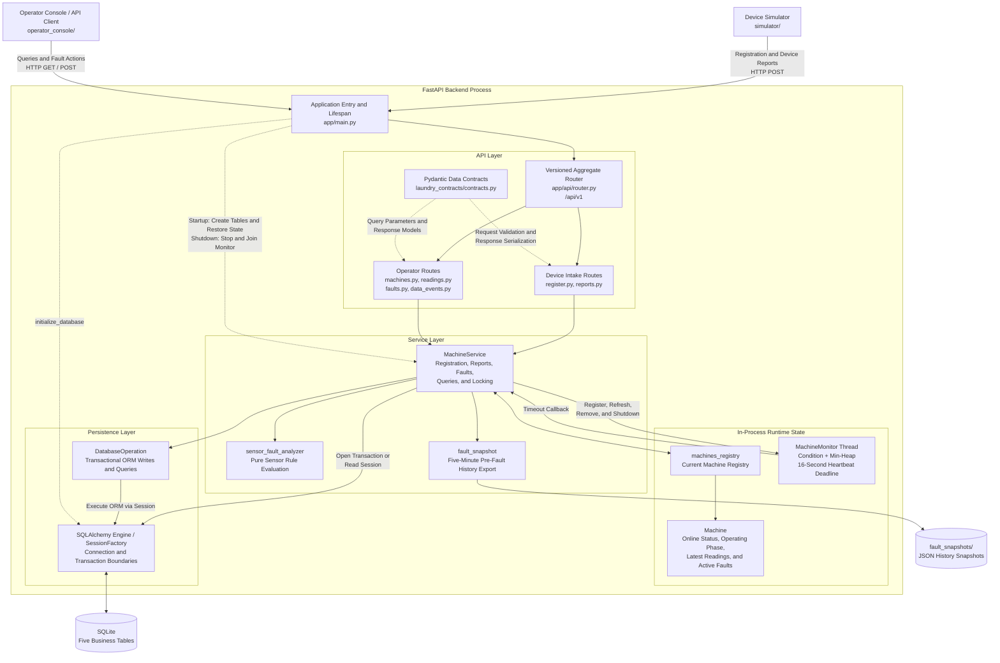
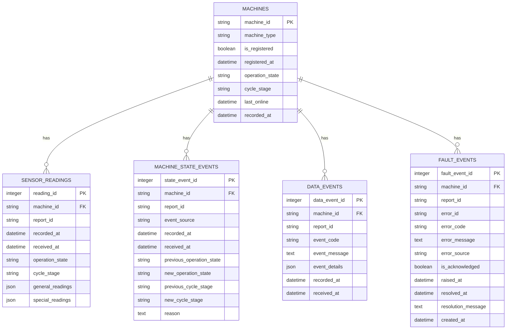
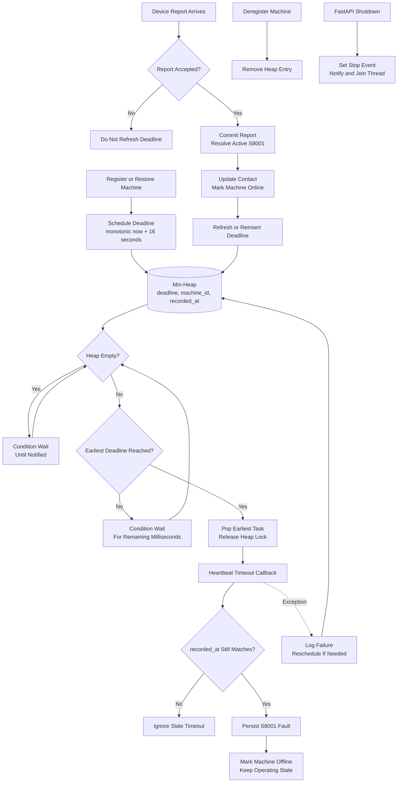

# Laundry Equipment Monitoring System — Fluff & Fold Clothes Inc.
FastAPI / SQLAlchemy / SQLite / Pydantic / pytest / Python Concurrency | Backend Systems Prototype

A backend prototype for monitoring washers and dryers from an on-premises laundromat office computer. FastAPI receives machine reports, SQLite stores current snapshots and historical records, and heartbeat monitoring and sensor rules surface, acknowledge, and resolve machine faults.

The original assignment did not require a user interface. This project implements device-ingestion and query APIs, a machine simulator console, and an automatically refreshing operator terminal.

## Technology Stack

| Category | Technology | Purpose |
|---|---|---|
| Runtime | Python 3.11+ | Backend, simulator, operator console, and tests |
| Web API | FastAPI, Uvicorn | REST endpoints, routing, application lifecycle, and ASGI hosting |
| Data contracts | Pydantic, pydantic-settings | Request and response validation, shared contract models, and environment configuration |
| Persistence | SQLite, SQLAlchemy 2 | Local storage, ORM models, transactions, and queries |
| HTTP client | HTTPX | Simulator, operator console, and API test communication |
| Terminal UI | Textual | Automatically refreshing command-driven ASCII operator interface |
| Concurrency and scheduling | `threading`, `Condition`, `heapq`, `Queue` | Heartbeat monitoring, simulation loop, and console command delivery |
| Testing | pytest | Unit, database, API integration, and simulator tests |

See [requirements.txt](requirements.txt) for pinned direct dependency versions.

## Current Features

### Backend

- Exposes device-ingestion, current-state, history, and fault-management REST endpoints under `/api/v1`
- Registers, reactivates, and deregisters washers and dryers while retaining existing historical records
- Accepts periodic, state-change, device-error, and error-resolution reports
- Uses Pydantic to validate machine-specific report branches, sensor structures, enums, numeric ranges, and timezone-aware timestamps
- Uses `report_id` for idempotency and prevents older device timestamps from rolling back the current snapshot
- Maintains current machine state, online status, latest readings, and active faults in memory while persisting snapshots and history in SQLite
- Restores registered machines, latest readings, and active faults from SQLite at startup and stops the heartbeat thread during shutdown
- Marks a machine offline and records `S8001` after 16 seconds without an accepted report, then restores it automatically after valid contact
- Evaluates periodic and error-resolution readings for sensor anomalies, including fault creation, deduplication, and automatic resolution
- Stores and queries sensor readings, machine-state events, data-consistency events, and fault raise, acknowledgement, and resolution records
- Supports operator acknowledgement, manual fault resolution, and device-reported fault resolution
- Attempts to save a five-minute pre-fault JSON history snapshot when the first device `ErrorReport` is accepted

### Simulator

- Normal simulation
  - Sequentially simulates 20 washers and 16 dryers in one background thread and staggers their registrations
  - Runs machine-specific cycle stages automatically and sends a periodic report every 15 seconds per machine
  - Sends state-change reports on stage transitions and deregisters registered machines during shutdown

- Manual control and fault injection
  - Uses `list`, `select`, and `status` to inspect and choose a machine
  - Supports washer `unbalanced-load`, which raises vibration and pauses stage progress during spinning
  - Supports dryer `blocked-vent`, which lowers airflow, raises temperature, and eventually triggers an overtemperature protective shutdown
  - Uses `repair` to restore readings; dryers send an error-resolution report, while washers resume after reporting normal readings
  - Uses the `offline` and `online` communication backdoors to demonstrate heartbeat timeout and recovery

### Operator Console

- Provides a command-driven Textual ASCII interface that refreshes through the REST API every two seconds
- Shows backend connectivity, registration and online state, cycle stage, latest readings, and active-fault count on the dashboard
- Shows active faults, resolved faults, and immutable data events in the diagnostics view
- Retrieves fault details and the preceding five minutes of sensor, state, and data-event history by database fault ID
- Supports command-based fault acknowledgement and manual resolution
- Accesses all data through FastAPI rather than directly reading `MachineService` state or SQLite

## Operator Fault-Diagnosis Workflow

The operator console demonstrates a diagnosis workflow from fault discovery through confirmed recovery:

| Step | Action | Information or result |
|---|---|---|
| 1. Discover an anomaly | Watch the automatically refreshed dashboard | Offline machines, operation state, cycle stage, latest sensor readings, active-fault count, and each active fault's `Fault ID`, code, and source |
| 2. Open diagnostics | Enter `diagnostics` | Up to 100 records per category for active faults, resolved faults, and data-consistency events, including kind, severity, acknowledgement state, and event time |
| 3. Interpret the code | Look up the code in [fault_codes.md](laundry_contracts/docs/fault_codes.md) | Fault kind, detection authority, equipment action, latching, acknowledgement or reset requirements, and suggested operator action |
| 4. Inspect context | Enter `fault <fault_id>` | Fault details and the preceding five minutes of sensor readings, state changes, and data events |
| 5. Acknowledge the fault | Enter `ack <fault_id>` | Marks the active fault as seen without resolving it or changing machine operation |
| 6. Address the cause | Inspect the machine, communication path, or data quality | Distinguishes device faults, server analytics warnings, heartbeat communication loss, and data-consistency events |
| 7. Confirm recovery | Wait for a device resolution report or enter `resolve <fault_id>` | Retains fault history, records the resolution time, and allows the operator to verify current online state, operation state, and readings |

The console's `fault_id` is the database `fault_event_id` shown in the first fault-list column. It is not the device-provided string `error_id`.

Diagnostic sources:

- `device`: a device-reported fault or protective shutdown; inspect the code, fault-time readings, and repair result
- `analytics`: an anomaly derived from periodic readings; inspect the trend and whether later normal readings resolve the warning
- `heartbeat_monitor`: no accepted report for more than 16 seconds; inspect machine power, networking, and the reporting process
- `data_events`: immutable audit records for report gaps or state-sequence mismatches; these do not necessarily indicate a physical machine fault

For a device `ErrorReport`, the backend also attempts to write the preceding five minutes of persisted history to `fault_snapshots/fault-<fault_id>.json`. A successfully generated snapshot can be inspected offline even when the operator console is not running. Analytics warnings, heartbeat faults, and data events do not create JSON snapshots, but they remain queryable in SQLite through the diagnostics APIs.

## System Structure

The system has three separately running components: the operator console, FastAPI backend, and device simulator. The console and simulator communicate with the backend only through REST APIs and do not share backend memory or SQLite connections. The backend is a single-process modular monolith divided into API, service coordination, runtime state, monitoring and analytics, and persistence layers.

### Backend Architecture



Device reports follow this path:

```text
JSON request
→ Pydantic validation
→ Service registration check
→ SQLite transaction
→ In-memory state and heartbeat update
→ HTTP result
```

Layer responsibilities:

- `app/main.py` creates the application and owns its lifecycle. Startup creates missing tables and restores registered machines, latest readings, and active faults; shutdown stops and joins the heartbeat thread.
- API routes handle HTTP, Pydantic parameters, and status-code mapping. Business state is delegated to the shared `MachineService`.
- `MachineService` coordinates backend workflows and protects the in-memory registry and report handlers with a mutex. Report transactions commit before memory and heartbeat state are updated, preventing a failed database write from leaving an accepted in-memory state.
- `Machine` represents current in-process state. Machine lists, individual status, and latest readings come from memory; historical readings, faults, data events, and fault context come from SQLite through `DatabaseOperation`.
- `MachineMonitor` is the backend's single application-managed monitoring thread. It uses monotonic milliseconds, a `Condition`, and a min-heap to wait for the next heartbeat deadline, then delegates timeout handling to `MachineService`.
- `sensor_fault_analyzer` is a side-effect-free rule evaluator. `fault_snapshot` writes an already-queried fault context to JSON.
- `SessionFactory` defines transaction and query session boundaries. `DatabaseOperation` centralizes ORM access to the five business tables, and routes do not access the database directly.

## Project Layout

```text
app/
├── api/
│   ├── routes/
│   │   ├── health.py            # Health endpoint
│   │   ├── register.py          # Registration and deregistration
│   │   ├── reports.py           # Four device report types
│   │   ├── machines.py          # Current machine-state queries
│   │   ├── readings.py          # Historical reading queries
│   │   ├── data_events.py       # Data-event queries
│   │   └── faults.py            # Fault queries, acknowledgement, and manual resolution
│   └── router.py                # Versioned route aggregation
├── core/
│   └── config.py                # Environment and application settings
├── database/
│   ├── base.py                  # SQLAlchemy declarative base
│   ├── models.py                # SQLite ORM models
│   ├── operation.py             # Database writes and queries
│   └── session.py               # Engine, SessionFactory, and schema initialization
├── machines/
│   ├── machines.py              # In-memory machine state
│   └── machine_monitor.py       # Heartbeat monitor thread
├── services/
│   ├── machine_service.py       # Business workflow coordination
│   ├── fault_snapshot.py        # Fault-history JSON snapshots
│   └── sensor_fault_analyzer.py # Sensor fault rules
└── main.py                      # FastAPI entry point and lifespan
laundry_contracts/
└── contracts.py                 # Request, response, enum, and validation models
simulator/
├── main.py                      # Simulation loop and console
├── machine.py                   # Shared device behavior
├── washer.py                    # Washer workflow
├── dryer.py                     # Dryer workflow
└── faults.py                    # Simulated fault behavior
operator_console/
├── main.py                      # Command input, refresh loop, and application lifecycle
├── api_client.py                # Asynchronous operator API client
└── views.py                     # ASCII tables and view rendering
scripts/
└── load_smoke.py                # Concurrent smoke load against a real Uvicorn process
tests/
├── test_api_integration.py      # FastAPI, service, and SQLite integration test
└── ...                          # Contract, database, heartbeat, simulator, and console tests
```

## Data Contracts

Every device report includes these common fields:

| Field | Meaning |
|---|---|
| `machine_id` | Machine identifier |
| `machine_type` | `washer` or `dryer` |
| `report_id` | Idempotency identifier for the report |
| `recorded_at` | Timezone-aware device event time, normalized to UTC when accepted |

`machine_type` is Pydantic's discriminator field. Washer reports must contain washer readings, and dryer reports must contain dryer readings.

### Sensor Readings

| Category | Fields |
|---|---|
| General | `vibration`, `door_locked` |
| Washer-specific | `water_level`, `water_temperature` |
| Dryer-specific | `air_temperature`, `air_flow_speed`, `moisture` |

### Report Types

| Report | Content | Backend handling |
|---|---|---|
| `PeriodicReport` | Current operation state, cycle stage, and defined sensor readings | Stores a reading, updates the current snapshot, and evaluates sensor rules |
| `ChangeOfStateReport` | Previous and new operation states, stages, and reason | Stores state history and updates the current snapshot |
| `ErrorReport` | Fault details, fault-time readings, and an optional state change | Stores the reading and fault, and stores the state change when included |
| `ErrorResolutionReport` | `error_id`, resolution message, current state, and recovered readings | Stores recovered readings, resolves the device fault, and reevaluates sensor rules |

## Duplicate Reports

All four device report types use `machine_id + report_id` to determine whether that report type has already been processed. Device error reports also use `machine_id + error_id` so the same fault instance cannot be raised twice under different report IDs.

| Result | API behavior |
|---|---|
| First receipt | HTTP `200`, `is_duplicate=false` |
| Same report received again | HTTP `200`, `is_duplicate=true` |
| Machine or target fault not found | HTTP `404` |

A duplicate report does not write another database row, modify in-memory state, process faults, or refresh the heartbeat deadline. A report with a device timestamp older than the current in-memory snapshot is also returned as a duplicate result so it cannot roll back current state.

Example response:

```json
{
  "machine_id": "washer-01",
  "report_id": "periodic-001",
  "accepted_at": "2026-07-22T20:00:00Z",
  "is_duplicate": true
}
```

## Database

Default database URL:

```text
sqlite:///./laundry.db
```

SQLite is embedded and does not require a separate database service. At startup, FastAPI creates missing tables, restores still-registered machines with their latest readings and active faults, and adds them back to heartbeat monitoring. Restored machines remain offline until they send a new accepted report.

| Table | Purpose |
|---|---|
| `machines` | Persistent current snapshot and registration state for each machine |
| `sensor_readings` | Historical readings from periodic, device-error, and error-resolution reports |
| `machine_state_events` | State-change history and reconciliation records when a state-change report is missing |
| `data_events` | Immutable audit events for report gaps and state-sequence mismatches |
| `fault_events` | Active and historical faults created by devices, heartbeat monitoring, and backend analytics |

### Database Schema



`machines.machine_id` is the foreign key referenced by the other four tables. Every SQLite connection enables `PRAGMA foreign_keys=ON`. Deregistration sets `is_registered` to `false` and clears current operation state and stage; the machine row and related history are retained.

Nullable fields:

- `machines`: `registered_at`, `operation_state`, `cycle_stage`, `last_online`, `recorded_at`
- `sensor_readings`: `operation_state`, `cycle_stage`
- `machine_state_events`: `previous_cycle_stage`, `new_cycle_stage`, `reason`
- `fault_events`: `report_id`, `error_message`, `resolved_at`, `resolution_message`

Primary uniqueness rules and query indexes:

| Table | Unique constraint | Query index |
|---|---|---|
| `machines` | Primary key `machine_id` | Primary-key index |
| `sensor_readings` | `(machine_id, report_id)` | `(machine_id, recorded_at)` |
| `machine_state_events` | `(machine_id, report_id)` | `(machine_id, recorded_at)` |
| `data_events` | `(machine_id, report_id, event_code)` | `(machine_id, recorded_at)` |
| `fault_events` | `(machine_id, error_id)` | `(machine_id, resolved_at)`, `(error_code, raised_at)` |

`machine_type`, `operation_state`, `event_source`, and `error_source` use string enums with database check constraints. `general_readings`, `special_readings`, and `event_details` use JSON to retain machine-specific sensor structures and data-event context.

Three timestamps serve different purposes:

- `recorded_at`: device event time
- `received_at`: time a historical row is received by the database
- `last_online`: server-observed time of the most recent accepted machine contact

Each running `Machine` also stores the most recent accepted report's `recorded_at` and the most recent sensor-bearing report as `latest_reading`. Machine-status APIs and the operator dashboard read this value from memory instead of querying sensor history on every refresh. A state-change report updates the last report time without replacing the latest sensor reading.

Deregistration does not delete history. The current snapshot is marked unregistered, while existing reading, state, and fault records remain available.

`Base.metadata.create_all()` creates missing tables but does not migrate existing schemas. During development, a model change currently requires recreating the development database or adding a migration tool.

## Heartbeat Monitoring

Machines do not send a separate heartbeat request. An accepted periodic, state-change, device-error, or error-resolution report counts as successful machine contact.

### Time and Scheduling

- The simulator normally sends a periodic report every 15 seconds, while the backend uses a 16-second timeout to provide a one-second grace period.
- Deadlines use backend `monotonic_ns()` converted to integer milliseconds when a report is accepted. Wall-clock or timezone changes do not alter an already scheduled wait.
- `recorded_at` is device event time. It rejects older reports and versions timeout tasks, but it does not calculate the 16-second wait.
- The monitor stores `(deadline_milliseconds, machine_id, recorded_at)` in a min-heap. The heap root is the next machine to check, so the monitor does not scan all machines on a fixed interval.
- A `Condition` shares the heap's mutex. Waiting releases that lock; registration, report, deregistration, and shutdown operations modify the heap and call `notify()`, causing the monitor to recalculate the nearest deadline.

### Processing Flow

1. A newly registered machine is marked online and scheduled. The first registration starts the single monitor thread.
2. At backend restart, still-registered machines are restored from SQLite as offline and given a new 16-second deadline. An accepted report returns them online at any time; missing the deadline first records a new `S8001`.
3. The monitor reads only the heap root. It waits indefinitely when the heap is empty or uses the remaining milliseconds as a timed wait before the next deadline.
4. Only a report that passes validation and commits its database transaction updates memory and calls `update_machine()` to move the deadline 16 seconds forward.
5. Duplicate, older, unregistered, or otherwise rejected reports do not refresh the heartbeat.
6. When a deadline expires, the monitor pops the heap root, releases the heap lock, and invokes `MachineService.handle_heartbeat_timeout()`.
7. The service compares the task's `recorded_at` with the machine's current `recorded_at`. A mismatch means the task is stale, so it is ignored instead of overwriting newer contact state.
8. A valid timeout first writes `S8001 device_communication_lost` to `fault_events`. Only after that succeeds is the in-memory machine marked offline and given the active fault. Its existing `operation_state` and `cycle_stage` are not changed to `FAULTED`.
9. After a successful timeout, the machine is temporarily absent from the heap, so it does not produce a new communication fault every 16 seconds. A later accepted report resolves active `S8001` records in SQLite and memory, updates `last_online`, marks the machine online, and reinserts its deadline.
10. Deregistration removes the machine's heap entry. FastAPI shutdown sets `stop_event`, wakes the monitor, and uses `join()` to wait for the thread to exit.

### Time Complexity

Let `n` be the number of monitored machines:

| Operation | Time complexity | Reason |
|---|---:|---|
| Register a machine | `O(log n)` | Pushes one deadline onto the min-heap |
| Read the next deadline | `O(1)` | Reads the heap root |
| Pop an expired machine | `O(log n)` | Pops the heap root |
| Refresh a machine deadline | Worst-case `O(n)` | Locates the machine by scanning the current heap, then restores heap order |
| Deregister a machine | `O(n)` | Locates and removes the entry, then restores heap order |
| Empty-heap or timed wait | `O(1)` | Blocks with `Condition.wait()` rather than polling |

If the reporting machine is already at the heap root, which is the usual case during normal staggered reporting, refresh avoids a full scan and costs `O(log n)`. The strict worst case remains `O(n)`.



The timeout callback runs after the monitor releases the heap lock, so database work does not hold the scheduling lock. `MachineService` uses its own mutex to prevent report and timeout handlers from concurrently mutating machine state. If the timeout callback raises an exception, the monitor logs it and reschedules the machine 16 seconds later when no newer task exists; the monitoring thread remains alive.

## Fault Management

Backend fault sources:

| Source | Meaning |
|---|---|
| `device` | Fault reported directly by a machine |
| `heartbeat_monitor` | Report timeout detected by the backend |
| `analytics` | Fault derived by the backend from machine state or sensor readings |

Acknowledgement and resolution are distinct operations:

- `acknowledge`: records that the operator has seen the fault; it does not resolve the underlying condition
- `resolve`: records the resolution time and message while retaining fault history

A machine can resolve a fault with `ErrorResolutionReport`. An operator can also resolve a fault manually through the fault-management API.

### Fault-History Snapshots

After accepting the first device `ErrorReport`, the backend attempts to write the preceding five minutes of already-persisted history to:

```text
fault_snapshots/fault-<fault_event_id>.json
```

The UTF-8 JSON file contains the fault record, sensor readings, state events, and data events. Its filename uses only the database-generated numeric fault ID, and duplicate error reports do not generate another snapshot. A file-write failure is logged but does not roll back the accepted fault report. `fault_snapshots/` is runtime data and is not committed to Git.

Only a device `ErrorReport` triggers this automatic file snapshot. Analytics warnings, heartbeat faults, and data events remain queryable in SQLite but do not create snapshot files.

### Automatic Sensor Rules

Periodic and error-resolution reports invoke `sensor_fault_analyzer.py`. The prototype evaluates these rules:

| Diagnostic code | Trigger |
|---|---|
| `W1001` | Vibration greater than `10.0 m/s²` |
| `W2101` | Washer water temperature greater than `80°C` |
| `W3101` | Dryer air temperature greater than `90°C` |
| `W3201` | Dryer airflow lower than `0.5 m/s` while running |

A continuously active analytics condition does not create another record every 15 seconds. When readings return to normal, the active analytics fault is resolved while its historical row remains.

Loss of the door interlock during operation is treated as local device protection rather than a server-generated analytics fault. When the simulator's blocked vent reaches the protective temperature, the simulated device sends an `F3102` overtemperature-trip report.

These thresholds are demonstration values. A real deployment would replace them with limits supplied by the equipment manufacturer.

## API

Business routes use `/api/v1` by default.

### System Status

| Method | Path | Purpose |
|---|---|---|
| `GET` | `/api/v1/health` | Health check |

### Machine Management and Queries

| Method | Path | Purpose |
|---|---|---|
| `POST` | `/api/v1/machines/register` | Register a new machine or reactivate a historical machine |
| `POST` | `/api/v1/machines/deregister` | Deregister a machine while retaining history |
| `GET` | `/api/v1/machines` | List current machine status |
| `GET` | `/api/v1/machines/{machine_id}` | Get one machine's current status |

### Device Reports

| Method | Path | Purpose |
|---|---|---|
| `POST` | `/api/v1/reports/periodic` | Accept periodic state and sensor readings |
| `POST` | `/api/v1/reports/change-of-state` | Accept a state-change report |
| `POST` | `/api/v1/reports/error` | Accept a device fault and fault-time readings |
| `POST` | `/api/v1/reports/error-resolution` | Accept fault resolution and recovered readings |

### Readings, Data Events, and Faults

| Method | Path | Purpose |
|---|---|---|
| `GET` | `/api/v1/machines/{machine_id}/readings` | Query historical machine readings |
| `GET` | `/api/v1/data-events` | Query immutable data-consistency events |
| `GET` | `/api/v1/faults` | Query faults across machines |
| `GET` | `/api/v1/faults/{fault_event_id}/context` | Query a fault and its preceding machine history |
| `GET` | `/api/v1/machines/{machine_id}/faults` | Query faults for one machine |
| `POST` | `/api/v1/machines/{machine_id}/faults/{error_id}/acknowledge` | Acknowledge a fault without resolving it |
| `POST` | `/api/v1/machines/{machine_id}/faults/{error_id}/resolve` | Resolve a fault manually |

Interactive request and response documentation is available from Swagger UI while the service is running:

<http://127.0.0.1:8000/docs>

## Query Examples

Query current machine state:

```text
GET /api/v1/machines
GET /api/v1/machines/washer-01
```

Query the latest 20 readings recorded while one machine was running:

```text
GET /api/v1/machines/washer-01/readings?operation_state=running&limit=20
```

The readings endpoint supports:

- `start_time`
- `end_time`
- `operation_state`
- `limit`, from 1 to 1000, default 100

Query the latest 20 missing-state-report events for one machine:

```text
GET /api/v1/data-events?machine_id=washer-01&event_code=D9001&limit=20
```

The data-event endpoint supports `machine_id`, `event_code`, and `limit`.

Query unresolved and unacknowledged faults:

```text
GET /api/v1/faults?active=true&acknowledged=false
```

The fault endpoint supports:

- `active`
- `acknowledged`
- `limit`, from 1 to 1000, default 100

Query fault 1 and its preceding five minutes of persisted history:

```text
GET /api/v1/faults/1/context?minutes=5
```

The response contains the fault record and sensor readings, state events, and data events within the time window. `minutes` ranges from 1 to 60 and defaults to 5.

## Local Development

Python 3.11 or newer is required.

### Windows PowerShell

Open PowerShell in the repository root. The backend, simulator, and operator console each need a separate terminal.

Create the virtual environment and install dependencies:

```powershell
python -m venv .venv
.\.venv\Scripts\Activate.ps1
python -m pip install -r requirements.txt
```

Start FastAPI in the first terminal:

```powershell
.\.venv\Scripts\Activate.ps1
python -m uvicorn app.main:app --reload
```

Available after startup:

- Swagger API documentation: <http://127.0.0.1:8000/docs>
- OpenAPI JSON: <http://127.0.0.1:8000/openapi.json>
- Health check: <http://127.0.0.1:8000/api/v1/health>

Start the simulator in the second terminal:

```powershell
.\.venv\Scripts\Activate.ps1
python -m simulator.main
```

When the backend uses a different host, port, or API prefix, provide the complete simulator API base URL:

```powershell
python -m simulator.main --api-base-url http://127.0.0.1:8000/api/v2
```

Start the operator console in the third terminal:

```powershell
.\.venv\Scripts\Activate.ps1
python -m operator_console.main
```

If PowerShell blocks `Activate.ps1`, skip activation and replace `python` in the commands above with `.\.venv\Scripts\python.exe`.

### Five-Minute Demo

After starting all three programs, wait about 20 seconds for all 36 simulated machines to finish staggered registration.

1. In the simulator terminal, select a dryer and verify that it is `RUNNING` in `HEATING` or `DRYING`:

   ```text
   select dryer-01
   status
   ```

2. Inject a blocked-vent fault:

   ```text
   fault blocked-vent
   ```

   The simulator freezes the current stage but continues periodic reporting. Over roughly one to two minutes, airflow falls and temperature rises until the device sends `F3102 dryer_overtemperature_trip` and enters protective shutdown.

3. In the operator console, open the active diagnostics:

   ```text
   diagnostics
   ```

   Find the numeric `Fault ID` for `F3102`, then inspect its details and preceding five minutes of history:

   ```text
   fault <fault_id>
   ack <fault_id>
   ```

4. Begin repair from the simulator terminal:

   ```text
   repair
   ```

   After the readings recover, the simulator sends an error-resolution report. Run `diagnostics` again in the operator console to inspect the fault's raise, acknowledgement, and resolution information.

5. Demonstrate heartbeat loss from the simulator terminal:

   ```text
   offline
   ```

   After more than 16 seconds, the operator console shows the machine offline with `S8001 device_communication_lost`. Restore communication:

   ```text
   online
   ```

   The next accepted report marks the machine online and automatically resolves the active `S8001`.

6. When finished, enter `quit` in both the simulator and operator console, then press `Ctrl+C` in the backend terminal. The simulator deregisters its registered machines during shutdown.

## Simulator

The simulator creates 20 washers and 16 dryers and staggers registration by 0.5 seconds. One background thread advances every machine sequentially and sends each machine's periodic report every 15 seconds. The main thread handles console input and sends commands to the simulation thread through a `Queue`.

Normal cycle stages:

```text
Washer: FILLING → WASHING → DRAINING → SPINNING → COMPLETE → IDLE
Dryer:  HEATING → DRYING → COOLING → COMPLETE → IDLE
```

Console commands:

| Command | Purpose |
|---|---|
| `list` | Show operation state, stage, readings, communication state, and active simulated fault for every machine |
| `select <machine_id>` | Select the machine used by subsequent commands |
| `status` | Show detailed status for the selected machine |
| `fault blocked-vent` | Inject a blocked-vent fault into the selected dryer |
| `fault unbalanced-load` | Inject an unbalanced-load fault into the selected washer |
| `repair` | Start repairing the selected machine's active simulated fault |
| `offline` | Stop reports and freeze the selected machine's local workflow to simulate communication loss |
| `online` | Restore the selected machine's communication and local workflow |
| `help` | Show simulator command help |
| `quit` | Stop the simulator and deregister registered machines |

`blocked-vent` is supported only when a dryer is `RUNNING` in `HEATING` or `DRYING`. After injection:

```text
Freeze the current stage
→ Continue periodic reports
→ Gradually reduce airflow and increase temperature
→ Reach the protective threshold
→ Send ErrorReport and enter FAULTED
```

After `repair`:

```text
Gradually restore sensor readings
→ Send ErrorResolutionReport with recovered readings
→ Clear the active fault
→ Send the FAULTED-to-IDLE state report
```

`unbalanced-load` is supported only for a `RUNNING` washer. It can be armed during any running stage, but vibration increases and the stage timer pauses only after the washer enters `SPINNING`. Periodic reports continue, and the backend creates `W1001` after vibration exceeds the threshold. `repair` restores normal vibration, immediately sends a normal periodic reading, and resumes the spinning stage.

`offline` is a simulator-only communication backdoor. It freezes the selected machine's local workflow and stops all reports without deregistering the machine or generating an `ErrorReport`. After the 16-second timeout, the backend creates `S8001` and shows the machine offline. `online` resumes the frozen workflow; because the periodic deadline has passed, the next simulation loop immediately sends the current report and restores backend online status.

`quit` stops the simulation loop and deregisters registered machines. HTTP failures are printed; the prototype does not implement retries, offline buffering, or reliable delivery.

## Operator Console

The operator console connects to `http://127.0.0.1:8000/api/v1` by default and refreshes its current view every two seconds. It uses FastAPI exclusively rather than reading `MachineService` or SQLite directly. The interface has one automatically refreshed ASCII output region and one text command input; table navigation is not required.

Console commands:

| Command | Action |
|---|---|
| `help` | Show command help |
| `diagnostics` | Show active faults, resolved faults, and data events across machines |
| `fault <fault_id>` | Show one fault and its preceding five minutes of history |
| `dashboard` | Return to the machine overview |
| `ack <fault_id>` | Acknowledge an active fault by the ID shown in the console |
| `resolve <fault_id>` | Manually resolve a fault by the ID shown in the console |
| `quit` | Exit the operator console |

The diagnostics view resolves fault kind and severity through the diagnostic-code catalog. The current simulator uses only codes defined by the `DiagnosticCode` enum.

To use another backend address:

```powershell
python -m operator_console.main --api-base-url http://127.0.0.1:8000/api/v2
```

## Configuration

The project starts without an `.env` file because the defaults are runnable:

```dotenv
FFC_APP_NAME=Fluff and Fold Clothes Inc API
FFC_APP_VERSION=0.1.0
FFC_API_V1_PREFIX=/api/v1
FFC_DEBUG=false
FFC_DATABASE_URL=sqlite:///./laundry.db
```

Create `.env` in the repository root only when overriding defaults. Application environment variables use the `FFC_` prefix.

## Testing

The pytest suite uses in-memory SQLite or mock HTTP transports and does not modify the repository's `laundry.db`.

Run the full suite:

```powershell
python -m pytest -q -p no:cacheprovider
```

Coverage includes:

- Pydantic contracts and discriminated machine types
- FastAPI routes and query parameters
- SQLite schema and primary business lifecycles
- MachineService and MachineMonitor coordination
- Monotonic millisecond time and heartbeat deadlines
- Heartbeat races, callback exceptions, and thread shutdown
- Sensor-fault creation, deduplication, and automatic resolution
- Device-fault acknowledgement and resolution
- Duplicate-report idempotency and protection from older device timestamps
- Startup restoration from SQLite into memory
- Simulator workflows, faults, repairs, and deregistration
- Custom simulator API base URL
- FastAPI startup and heartbeat-thread shutdown
- FastAPI, MachineService, and SQLite fault-lifecycle integration
- Operator API client, ASCII commands, and automatic refresh

Run the concurrent smoke load against a real Uvicorn process:

```powershell
python scripts/load_smoke.py
```

The script uses a temporary SQLite database, registers 36 machines, and concurrently sends 180 periodic reports. It then checks database integrity, foreign keys, duplicate reports, current-snapshot freshness, and suspicious timestamps. The temporary database is deleted after the run, and the repository's `laundry.db` is not modified.
